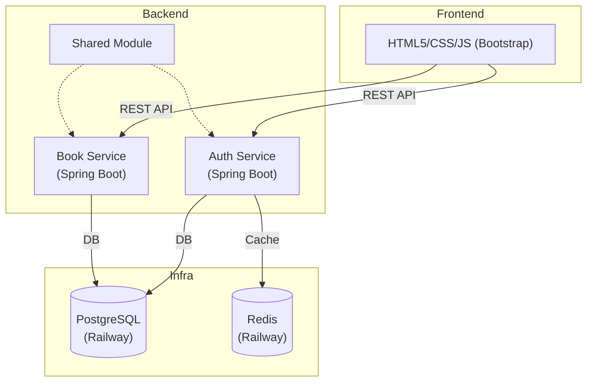
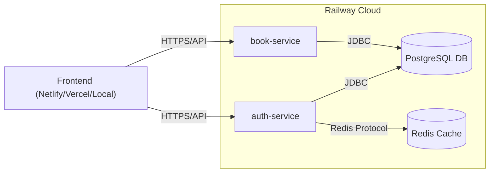

# BookVault: Comprehensive Project Documentation & Analysis

---

## Table of Contents
1. [Project Overview](#1-project-overview)
2. [System Architecture](#2-system-architecture)
    - [Frontend Structure](#21-frontend-structure)
    - [Backend Services](#22-backend-services)
    - [Databases and Caching](#23-databases-and-caching)
    - [Architecture Diagram](#24-architecture-diagram)
3. [Features](#3-features)
4. [Development Workflow & Setup](#4-development-workflow--setup)
    - [Frontend Setup](#41-frontend-setup)
    - [Backend Setup](#42-backend-setup)
    - [Customization](#43-customization)
    - [Contribution Guidelines](#44-contribution-guidelines)
5. [Deployment Approach](#5-deployment-approach)
    - [Railway Deployment](#51-railway-deployment)
    - [Local Development](#52-local-development)
    - [Deployment Diagram](#53-deployment-diagram)
6. [API and Security](#6-api-and-security)
    - [Security Mechanisms](#61-security-mechanisms)
    - [Error Handling](#62-error-handling)
7. [Cost and Resource Concerns](#7-cost-and-resource-concerns)
    - [Railway Free Trial Limitations](#71-railway-free-trial-limitations)
    - [Potential Issues](#72-potential-issues)
8. [Recommendations and Mitigations](#8-recommendations-and-mitigations)
9. [Conclusion](#9-conclusion)
10. [References](#10-references)
11. [Appendix: Key API Endpoints & Examples](#11-appendix-key-api-endpoints--examples)

---

## 1. Project Overview

**BookVault** is a scalable, modern web application for discovering, buying, selling, and managing books. It features a robust backend built with Java (Spring Boot microservices) and a clean, responsive frontend using HTML5, CSS (Bootstrap), and JavaScript. The system is architected for modularity, security, and ease of deployment, with a focus on cloud-native best practices.

---

## 2. System Architecture

### 2.1. Frontend Structure

The frontend is modular and designed for easy navigation and maintainability:

```plaintext
BookVault/
├── index.html              # Landing page (Home)
├── booklisting.html        # Book product listing page
├── book-details.html       # Book details page
├── about.html              # About us page
├── contact.html            # Contact page (with map)
├── help.html               # Help Center / FAQ & Support
├── seller.html             # Seller dashboard
├── admin.html              # Admin dashboard
├── user.html               # User dashboard
├── login.html              # Login page
├── register.html           # Register page
│
├── asset/
│   ├── css/
│   │   └── bookvault.css   # All custom CSS styles
│   ├── img/
│   │   ├── logo/
│   │   ├── books/
│   │   ├── team/
│   │   └── ...
│   ├── js/
│   │   └── main.js         # Main JavaScript file
│   └── fonts/
│
├── vendor/                 # Third-party libraries (Bootstrap, etc.)
├── data/
│   └── books.json          # Demo/mock data
└── README.md               # Project notes/documentation
```

### 2.2. Backend Services

The backend is organized as a set of microservices, but for cost and simplicity, the current deployment merges and simplifies some services:

- **Auth Service**: Handles authentication, user management, JWT token issuance, role-based access (USER, SELLER, ADMIN), and login attempt tracking (with Redis). Key endpoints include registration, login, profile management, and admin user management.
- **Book Service**: Manages the book catalog, categories, reviews, inventory, and basic order processing. Key endpoints include book CRUD, category listing, reviews, and order management.
- **Shared Module**: Contains common utilities, DTOs, enums, and security helpers for code reuse and consistency.

> **Note:** The original architecture included separate User, Order, Discovery, and Config services. For Railway deployment, these have been merged or removed to reduce complexity and cost.

### 2.3. Databases and Caching

- **PostgreSQL**: Primary relational database for all persistent data (users, books, orders, etc.).
- **Redis**: Used for caching and login attempt tracking to enhance security and performance.

#### Example Database Schema (Simplified)

- **Users**: `id`, `email`, `password`, `first_name`, `last_name`, `role`, `created_at`, `updated_at`
- **Books**: `id`, `title`, `author`, `description`, `price`, `stock`, `created_at`
- **Categories**: `id`, `name`, `description`
- **Book Reviews**: `id`, `book_id`, `user_id`, `rating`, `comment`, `created_at`
- **Orders**: `id`, `user_id`, `total_amount`, `status`, `created_at`
- **Order Items**: `id`, `order_id`, `book_id`, `quantity`, `price`

### 2.4. Architecture Diagram



---

## 3. Features

- **Landing/Home page:** Discover new books and search collections.
- **Book Listing:** Product listing with search and filter capabilities.
- **Book Details:** Detailed info, reviews, and related books.
- **User Dashboard:** Purchase history, wishlist, favorites, and recommendations.
- **Seller Dashboard:** Upload books, manage listings, sales, and revenue.
- **Admin Dashboard:** Manage users, sellers, products, and platform data.
- **Help Center:** FAQs, support contact, and documentation.
- **Authentication:** Login, register, role-based navigation (frontend, backend integrated).
- **Contact Page:** Map, contact form, and business info.
- **Mobile Responsive:** Optimized for phones and tablets.
- **Consistent Branding:** Modern BookVault UI/UX and custom logo.

---

## 4. Development Workflow & Setup

### 4.1. Frontend Setup

1. **Clone or download** this repo.
2. Open the project in VS Code or your favorite editor.
3. Open `index.html` (or any page) in your browser to preview the UI.
4. For real data, configure the frontend to call your backend REST endpoints (update API URLs as needed in `config.js`).

### 4.2. Backend Setup (Java/Spring Boot Microservices)

1. Set up each Spring Boot microservice (see `backend/` directory).
2. Configure databases and application properties (see `application.yml` and `application-railway.yml`).
3. Start the services (see individual service README files for instructions or use provided scripts).
4. Ensure CORS is enabled for frontend-backend communication.

#### Example Local Startup

```bash
# Start dependencies
brew services start postgresql@14 redis

# Start services
./start-local-dev.sh

# Or manually:
cd backend/auth-service && mvn spring-boot:run -Dspring-boot.run.profiles=local
cd backend/book-service && mvn spring-boot:run -Dspring-boot.run.profiles=local
```

### 4.3. Customization

- **Branding:** Update `/asset/img/logo/bookvault-logo.png` for your own logo.
- **Images:** Place cover and team images in `/asset/img/books/` and `/asset/img/team/`.
- **CSS:** Extend `/asset/css/bookvault.css` for custom theming.

### 4.4. Contribution Guidelines

Pull requests and collaboration are welcome! Please open an issue for bugs or feature requests. See the MIT License for usage rights.

---

## 5. Deployment Approach

### 5.1. Railway Deployment

- **Platform**: [Railway](https://railway.app) – a cloud platform for deploying databases and services.
- **Services Deployed**:
  - `auth-service` (Spring Boot, Java)
  - `book-service` (Spring Boot, Java)
  - `PostgreSQL` (managed by Railway)
  - `Redis` (managed by Railway)

- **Deployment Steps**:
  1. Prepare service-specific configuration files (e.g., `application-railway.yml`).
  2. Use Railway CLI to create and deploy each service.
  3. Connect services to managed PostgreSQL and Redis instances.
  4. Update frontend configuration to point to deployed backend endpoints.

- **Profiles**: Uses Spring profiles (`railway`, `local`, `docker`) to switch between environments.

#### Example Railway CLI Commands

```bash
# Deploy auth service
railway service create auth-service
railway up --service auth-service

# Deploy book service  
railway service create book-service
railway up --service book-service
```

### 5.2. Local Development

- Run PostgreSQL and Redis locally.
- Start backend services with the `local` profile.
- Frontend can be served via any HTTP server.

### 5.3. Deployment Diagram



---

## 6. API and Security

- **JWT-based Authentication**: Stateless, secure, and scalable.
- **Role-based Authorization**: Enforces access control for users, sellers, and admins.
- **Login Attempt Protection**: Redis-backed, with temporary and permanent bans for brute-force attempts.
- **Input Validation & Sanitization**: Prevents common web vulnerabilities (SQL injection, XSS).
- **CORS Configuration**: Allows secure frontend-backend integration.

### 6.1. Security Mechanisms

- **Password Encryption**: All passwords are hashed using BCrypt before storage.
- **JWT Secret Management**: Secrets are stored in environment variables and never hardcoded.
- **Rate Limiting**: Ready for implementation to prevent abuse.
- **IP Banning**: Multiple failed login attempts from the same IP can trigger temporary bans.

### 6.2. Error Handling

All API responses follow a standard format:

```json
{
  "success": true,
  "data": { /* response data */ },
  "message": "Success message",
  "timestamp": "2025-07-06T09:34:49.818290019"
}
```

Error responses:

```json
{
  "success": false,
  "message": "Error message",
  "timestamp": "2025-07-06T09:34:49.818290019"
}
```

---

## 7. Cost and Resource Concerns

### 7.1. Railway Free Trial Limitations

- **Free Trial**: Railway offers a $5 free trial credit.
- **Service Costs**: Each running service (auth, book, Redis, PostgreSQL) consumes part of this credit.
- **Resource Limits**: Free tier has strict memory (typically 512MB per service) and compute limits.
- **Database Size**: PostgreSQL and Redis have storage and connection limits on the free plan.
- **Service Uptime**: Free services may be suspended or put to sleep after inactivity.

### 7.2. Potential Issues

#### a. **Cost Overruns**
- Running four services (auth-service, book-service, Redis, PostgreSQL) can quickly exhaust the $5 credit.
- After the credit is used, services will be suspended unless a paid plan is activated.

#### b. **Performance and Scalability**
- 512MB RAM per service may be insufficient under load, leading to crashes or slowdowns.
- Database and cache limits may restrict the number of users, books, or orders the system can handle.

#### c. **Service Availability**
- Free tier services may experience downtime or cold starts, impacting user experience.
- No guaranteed SLA (Service Level Agreement) on free plans.

#### d. **Data Persistence**
- Data in free-tier databases may be deleted after inactivity or if the project is deleted.
- Backups and data export are limited or manual.

#### e. **Security**
- Publicly exposed endpoints must be secured; misconfiguration could lead to data leaks.
- Redis and PostgreSQL should be protected with strong passwords and restricted access.

#### f. **Vendor Lock-in**
- Railway-specific configuration may hinder migration to other platforms (e.g., AWS, GCP, Azure).

---

## 8. Recommendations and Mitigations

- **Monitor Usage**: Regularly check Railway dashboard for credit and resource usage.
- **Optimize Services**: Merge services where possible to reduce the number of running instances.
- **Database Hygiene**: Periodically clean up unused data to stay within free tier limits.
- **Backups**: Export data regularly to prevent loss.
- **Prepare for Scale**: If expecting growth, plan for migration to a paid plan or another cloud provider.
- **Security Best Practices**: Use environment variables for secrets, enable HTTPS, and restrict database access.

---

## 9. Conclusion

BookVault is a well-architected, modern web application suitable for academic, MVP, or small-scale production use. The current deployment on Railway is cost-effective for development and demonstration but has clear limitations regarding cost, scalability, and persistence. For long-term or production use, consider upgrading to a paid plan or migrating to a more robust cloud infrastructure.

---

## 10. References

- [BookVault Backend README](backend/README.md)
- [BookVault API Documentation](backend/API_DOCUMENTATION.md)
- [Railway Documentation](https://docs.railway.app/)
- [Spring Boot Documentation](https://spring.io/projects/spring-boot)

---

## 11. Appendix: Key API Endpoints & Examples

### Auth Service APIs
- `POST /api/auth/register` - User registration
- `POST /api/auth/login` - User login
- `GET /api/auth/profile` - Get user profile
- `PUT /api/auth/profile` - Update user profile
- `GET /api/admin/users` - Admin: List users
- `PUT /api/admin/users/{id}` - Admin: Update user

#### Example: Register User
```json
{
  "email": "user@example.com",
  "password": "password123",
  "firstName": "John",
  "lastName": "Doe",
  "phone": "1234567890",
  "role": "USER"
}
```

### Book Service APIs
- `GET /api/books` - List books with search/filter
- `GET /api/books/{id}` - Get book details
- `POST /api/books` - Create book (SELLER/ADMIN)
- `PUT /api/books/{id}` - Update book (SELLER/ADMIN)
- `POST /api/books/{id}/reviews` - Add review
- `GET /api/categories` - List categories

#### Example: Book Response
```json
{
  "id": 1,
  "title": "The Great Gatsby",
  "author": "F. Scott Fitzgerald",
  "description": "A classic novel...",
  "price": 12.99,
  "stock": 5,
  "created_at": "2025-07-06T09:34:49.818290019"
}
```

### Health & Monitoring
- `GET /actuator/health` - Health check
- `GET /actuator/info` - Application info
- `GET /actuator/metrics` - Application metrics

---

## 12. Actual Implementation Concerns (Based on Code Analysis)

### 12.1. **Incomplete Features & TODOs**

**Seller Service Integration Issues:**
- `BookService.java` contains multiple TODOs indicating incomplete seller integration:
  ```java
  .sellerName("Seller") // TODO: Get from auth service
  // TODO: Implement when we have more order data
  // TODO: Implement proper month-over-month comparison
  ```

**Missing Analytics Implementation:**
- Revenue analytics, sales trends, and performance metrics are stubbed with TODO comments
- Seller dashboard analytics are incomplete

### 12.2. **Configuration & Deployment Issues**

**Service Discovery Problems:**
- `VERSION_MATRIX.md` indicates Config Service is failing:
  ```
  Config Service
  - Issue: Attempting to connect to remote Git repository over SSH
  - Status: ❌ Failing with timeout
  - Solution: Configure local file-based config or fix Git access
  ```

**Eureka Discovery Disabled:**
- All services have Eureka disabled for local development, but this creates service discovery gaps
- Services hardcode URLs instead of using service discovery

**Database Configuration Inconsistencies:**
- Multiple database configurations across services with different connection pool settings
- Redis configuration varies between services (some disabled, some enabled)

### 12.3. **Security & Authentication Concerns**

**JWT Secret Management:**
- Default JWT secret is hardcoded in configuration files:
  ```yaml
  jwt:
    secret: bookvault-secret-key-that-should-be-very-long-and-secure-in-production-environment
  ```
- Should be externalized to environment variables in production

**CORS Configuration Issues:**
- Some services have overly permissive CORS settings:
  ```java
  configuration.setAllowedOriginPatterns(List.of("*"));
  ```
- This allows any origin to access the API

**Login Attempt Service Dependency:**
- Redis dependency for login attempt tracking may cause authentication failures if Redis is unavailable
- No graceful fallback mechanism implemented

### 12.4. **Code Quality & Maintainability Issues**

**Lombok Disabled:**
- `VERSION_MATRIX.md` shows Lombok is disabled due to Java 21 compatibility:
  ```
  Lombok: 1.18.32 ✅ Java 21 + Latest IDEs (DISABLED)
  ```
- This led to manual getter/setter implementations, increasing code maintenance burden

**Code Duplication:**
- `JwtUtil.java` is duplicated across multiple services instead of using the shared module
- Same authentication filters repeated in each service

**Debug Code in Production:**
- `main.js` contains extensive debug logging that should be removed for production:
  ```javascript
  // Debug helpers (remove in production)
  window.debugCart = { ... }
  window.debugAuth = { ... }
  ```

### 12.5. **Testing & Quality Assurance**

**No Test Coverage Information:**
- No evidence of unit tests, integration tests, or test coverage reports
- Manual testing documented in `FRONTEND_FIXES_README.md` but no automated testing

**Frontend Error Handling:**
- Complex error handling logic in `main.js` with multiple fallback scenarios
- Indicates potential reliability issues with backend communication

### 12.6. **Performance & Scalability Concerns**

**Database Connection Pooling:**
- Different connection pool configurations across services
- Book service has higher pool sizes (20) than auth service, which may cause resource contention

**Frontend Performance:**
- Large `main.js` file (6000+ lines) with no minification or code splitting
- All JavaScript loaded synchronously, impacting page load times

### 12.7. **Documentation & Maintenance**

**Outdated Documentation:**
- `README.md` references microservices that have been removed/merged
- API documentation may not reflect current simplified architecture

**Environment-Specific Issues:**
- Multiple configuration profiles (local, railway, docker) with different settings
- Risk of configuration drift between environments

### 12.8. **Deployment & Infrastructure**

**Railway-Specific Dependencies:**
- Deployment scripts are tightly coupled to Railway platform
- Migration to other platforms would require significant reconfiguration

**Service Health Monitoring:**
- Limited health check implementation
- No alerting or monitoring for service failures

### 12.9. **Data Consistency & Integrity**

**Order Management:**
- Order processing logic in `OrderService.java` shows complex stock management
- Potential race conditions in stock updates during concurrent orders

**Cache Inconsistency:**
- Redis cache for login attempts may become inconsistent with database state
- No cache invalidation strategy documented

---

**Priority Recommendations:**

1. **Immediate:** Remove debug code and implement proper logging levels
2. **High:** Externalize JWT secrets and fix CORS configuration
3. **Medium:** Implement automated testing and fix TODO items
4. **Low:** Optimize frontend performance and consolidate configuration

---

## 13. Recent Production Fixes (July 2025)

### 13.1. Debug Code Removal (Frontend)

- **Status:** Completed (No redeployment required)
- **Scope:** `asset/js/main.js`, `config.js`
- **Details:**
  - All debug helper functions (e.g., `window.debugCart`, `window.debugAuth`, `window.testLogoutNow`) have been removed from the production code.
  - All verbose `console.log`, `console.warn`, and similar debug statements have been removed or converted to comments.
  - Debug comments and TODOs have been cleaned up for clarity.
- **Impact:**
  - Improves frontend performance and security.
  - Reduces console clutter for end users and production monitoring.
  - No functional changes to user experience.
  - No backend or redeployment required for these changes.

**Note:** Backend security and configuration issues (e.g., JWT secret, CORS) are still pending and require redeployment for resolution.

---

## Authors

* [Quang Sang Ngo]
* [QsngoSE@gmail.com/ https://github.com/QsNgoSE]

---